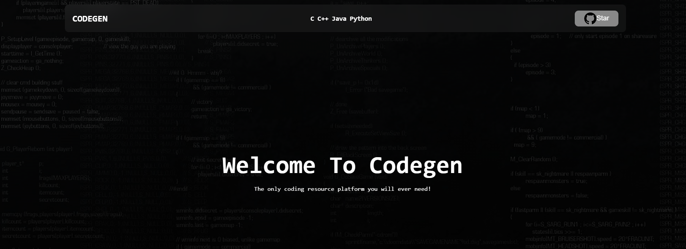

# Learn-Programming

[![GitHub stars]][stars]
[![GitHub issues]][issues]

A collection of resources and programs to learn high-level languages like C, C++, Java and Python. 

*SITE LIVE AT: https://software-labs-rcoem.github.io/Learn-Programming*

## Team Members
<table>
  <tr>
    <th>Sno</th>
    <th>Name</th>
    <th>Email</th>
    <th>Roll no</th>
  </tr>
  <tr>
    <td>1.</td>
    <td>Yagyesh Bobde</td>
    <td>bobdeyr@rknec.edu</td>
    <td>B-62</td>
  </tr>
  <tr>
    <td>2</td>
    <td>Pragati Borkar</td>
    <td>borkarps_1@rknec.edu</td>
    <td>B-70</td>
  </tr>
    <tr>
    <td>3</td>
    <td>Anushree Padole</td>
    <td>padoleap@rknec.edu</td>
    <td>B-69</td>
  </tr>
   <tr>
    <td>3</td>
    <td>Nandini Giri</td>
    <td>girinp@rknec.edu</td>
    <td>B-68</td>
  </tr>
  <!--   <tr>
    <td></td>
    <td></td>
    <td></td>
    <td></td>
  </tr> -->
</table>

## Project Stats

<!-- REFERENCES -->

[^env]: You will need to create a `.env` file in the root directory of the project.
[^lint]: We recommend using [`eslint`] and [`prettier`] to lint your code.
[^commit]: We strongly follow the [`Commit Message Conventions`]. This is important when commiting your code for a PR.

<!-- LINKS -->

[`node.js`]: https://nodejs.org/en/
[`mongodb`]: https://www.mongodb.com/
[`next.js`]: https://nextjs.org/
[`git`]: https://git-scm.com/
[node.js]: https://nodejs.org/en/
[pr]: https://github.com/Software-Labs-RCOEM/Learn-Programming/pulls
[stars]: https://github.com/Software-Labs-RCOEM/Learn-Programming/stargazers
[issues]: https://github.com/Software-Labs-RCOEM/Learn-Programming/issues
[changelog]: https://github.com/Software-Labs-RCOEM/Learn-Programming/blob/main/CHANGELOG.md
[`eslint`]: https://eslint.org/
[`prettier`]: https://prettier.io/
[`commit message conventions`]: https://conventionalcommits.org/en/v1.0.0/
[apache]: https://github.com/Software-Labs-RCOEM/Learn-Programming/blob/main/LICENSE.md
[`eta`]: https://www.javatpoint.com/eta-full-form

<!-- BADGES -->

[codefactor]: https://www.codefactor.io/repository/github/Software-Labs-RCOEM/Learn-Programming/badge/main
[license]: https://img.shields.io/github/license/Software-Labs-RCOEM/Learn-Programming
[github stars]: https://img.shields.io/github/stars/Software-Labs-RCOEM/Learn-Programming
[github issues]: https://img.shields.io/github/issues/Software-Labs-RCOEM/Learn-Programming